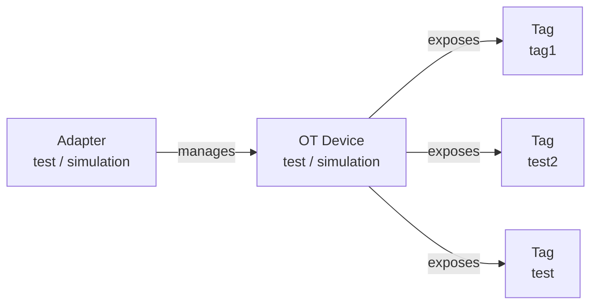
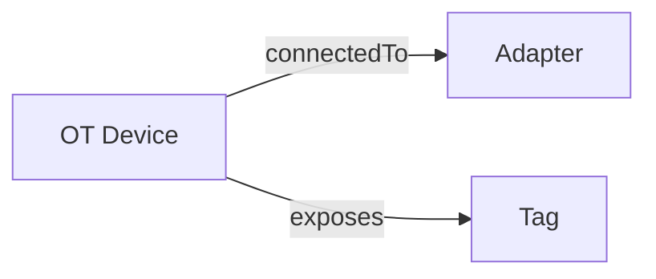
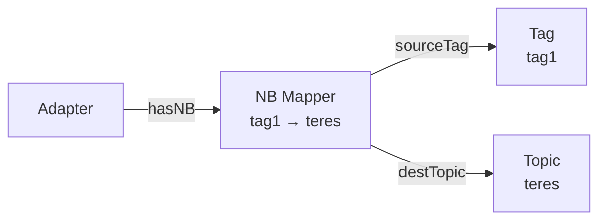
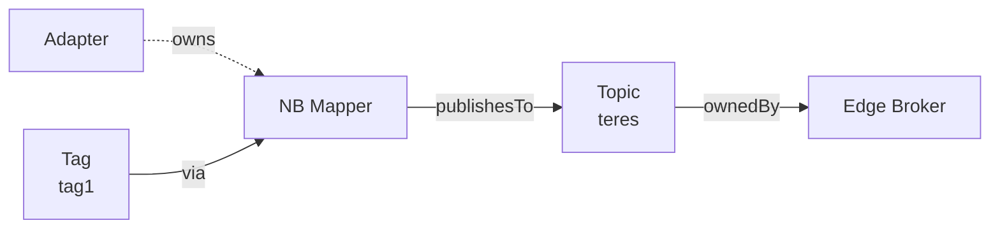
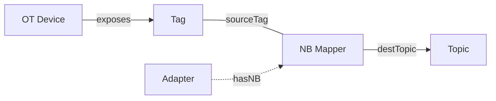
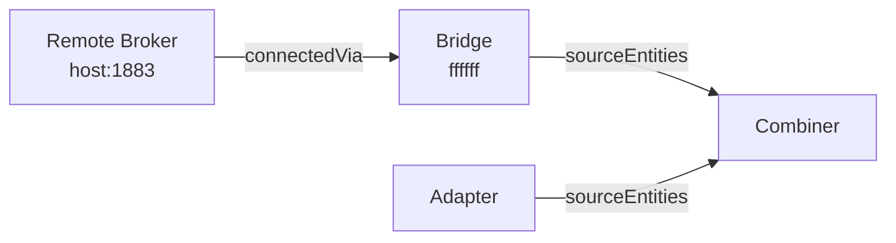
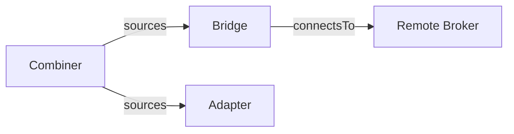
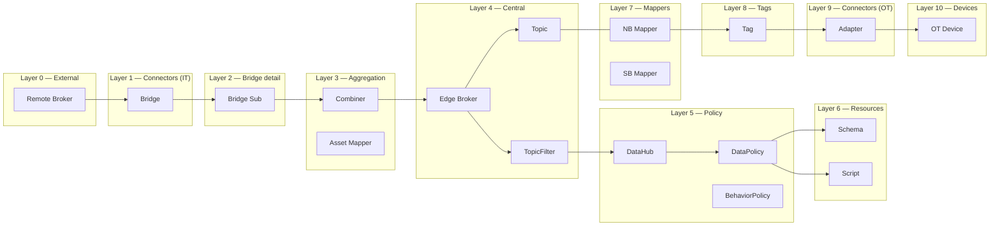

# Layout Analysis — Node Ordering & Edge Direction

Based on manual layout from screenshot (2026-03-01), exploring the ideal
data-flow ordering and edge semantics.

---

## Question 1: Device vs Adapter/Bridge ordering

**Current**: OT Device (rank 0) ← Adapter (rank 1) — adapter is "after" device.
Edge: `Adapter → manages → OT Device` (points left).

**Your manual layout shows**: `Adapter → OT Device → Tags` (left to right).

This makes sense conceptually: the Adapter is the IT-side connector, the
Device is the OT-side thing it connects to, and Tags are what the device
exposes. The data flows from the physical world inward.

But there's a second reading: `Device → Adapter` where the device is the
source of data. The adapter is the software that reads from it.

### Option A: ADAPTER → DEVICE → TAGS (current direction, fix ranks)



Rank order: Adapter(0) → Device(1) → Tag(2)

Reads as: "The adapter manages the device, the device exposes tags."
This matches your manual layout exactly.

### Option B: DEVICE → ADAPTER (reverse edge direction)



Rank order: Device(0) → Adapter(1) / Tag(1)

Reads as: "The device is the source, connected to an adapter."
More OT-engineer friendly but the adapter doesn't "come from" the device.

**Recommendation**: **Option A** — matches your manual layout and the
ontology semantics (adapter manages device, device exposes tags).

---

## Question 2: NB Mapper edge flow

**Current edges**:

```
Adapter → hasNorthboundMapper → NB Mapper
NB Mapper → sourceTag → Tag
NB Mapper → destinationTopic → Topic
```

**Problem**: The NB Mapper subtitle says "tag1 → teres" but the edges
don't flow that way visually. `sourceTag` points FROM mapper TO tag
(backwards from the data flow).

### Current (broken flow)



The mapper points TO its source tag — semantically correct ("this mapper
reads from this tag") but visually backwards.

### Proposed: Reverse sourceTag edge, inline mapper in flow



Rank order: Tag(2) → NB Mapper(3) → Topic(4) → Edge Broker(5)

The mapper sits between its source and destination in the flow.
The `owns` edge from Adapter is a secondary/structural edge (dashed),
not a flow edge.

### Alternative: Keep edges, just fix ranks



Same topology but Tag is ranked before NB Mapper in the flow axis.
The `hasNB` edge from Adapter is cross-flow (structural).

**Recommendation**: Reverse `sourceTag` edge direction to `Tag → readsFrom → NB Mapper`
or keep the edge but fix ranks so Tag < NB Mapper < Topic. The visual flow
should be: Tag → Mapper → Topic.

---

## Question 3: Bridge / Remote Broker ordering

**Current**: Bridge (rank 7) → connectsTo → Remote Broker (rank 8).

**Your manual layout shows**: `Remote Broker ← Bridge ← Combiner`
(remote broker on the LEFT, bridge in the middle).

This suggests: Remote Broker is the "external source/destination" and
the bridge is the connector to it, similar to how Adapter is the
connector to the Device.

### Option A: REMOTE BROKER → BRIDGE (mirror the device/adapter pattern)



Reads as: "The remote broker connects via the bridge."
Mirrors: "The OT device connects via the adapter."

### Option B: Keep current direction but fix ranks



Bridge and Remote Broker are at the right edge of the graph (outbound).

**Recommendation**: Your manual layout puts Remote Broker LEFT of Bridge.
This creates a nice symmetry:

```
Remote Broker → Bridge → ... → Adapter → OT Device
         (IT world)              (OT world)
```

The Edge Broker sits in the middle. Both sides "reach in" toward the
center. This is the most intuitive OT/IT convergence layout.

---

## Proposed Rank Order (LR)



Wait — this puts Remote Broker on the far LEFT and OT Device on the far
RIGHT. The flow goes from IT (left) through the Edge Broker (center) to
OT (right). This is an **IT-centric** view.

**Alternative (OT-centric — matches your screenshot better)**:

```
OT Device → Adapter → Tag → NB Mapper → Topic → Edge Broker → ...policies... → Bridge → Remote Broker
```

This is the **data flow direction**: data originates at the OT device and
flows through the system toward the IT world.

---

## Final Proposed Ranks (OT → IT data flow, LR)

| Rank | Entities                               | Rationale                     |
| ---- | -------------------------------------- | ----------------------------- |
| 0    | OT Device                              | Physical source (leftmost)    |
| 1    | Adapter                                | Manages device                |
| 2    | Tag, DomainTag                         | Exposed by device             |
| 3    | NB Mapper, SB Mapper                   | Transform between tag ↔ topic |
| 4    | Topic, TopicFilter, Edge Broker, Pulse | Central messaging layer       |
| 5    | DataHub, Combiner, AssetMapper         | Policy engine, aggregation    |
| 6    | DataPolicy, BehaviorPolicy             | Policies                      |
| 7    | Schema, Script                         | Policy resources              |
| 8    | Bridge, BridgeSubscription             | Outbound to IT                |
| 9    | Remote Broker                          | External broker (rightmost)   |

### Edge direction changes needed

| Current                               | Proposed                                                                                                                                                                    | Reason                                   |
| ------------------------------------- | --------------------------------------------------------------------------------------------------------------------------------------------------------------------------- | ---------------------------------------- |
| `Adapter → manages → Device`          | **Keep** (adapter at rank 1 → device at rank 0). Constraint will push Device LEFT of Adapter since Device has lower rank. Edge points "backward" but constraint is correct. | Rank constraint overrides edge direction |
| `NB Mapper → sourceTag → Tag`         | **Reverse to** `Tag → mappedBy → NB Mapper`                                                                                                                                 | Flow: tag data → mapper → topic          |
| `SB Mapper → destinationTag → Tag`    | **Keep** (SB is download: topic → mapper → tag)                                                                                                                             | Already correct for southbound           |
| `Bridge → connectsTo → Remote Broker` | **Keep**                                                                                                                                                                    | Bridge reaches out to remote             |

Actually, the rank constraint handles the positioning regardless of edge
direction. The edge `Adapter → manages → Device` will still position
Device at rank 0 (left) and Adapter at rank 1 (right of device) because
the constraint uses ENTITY_RANK, not edge direction.

So **no edge direction changes are strictly needed** — just rank
adjustments. The only visual issue is that some arrows point "backward"
(right to left), which the floating edges handle gracefully.

However, reversing `sourceTag` to `Tag → NB Mapper` would make the arrow
direction match the data flow and look cleaner.
