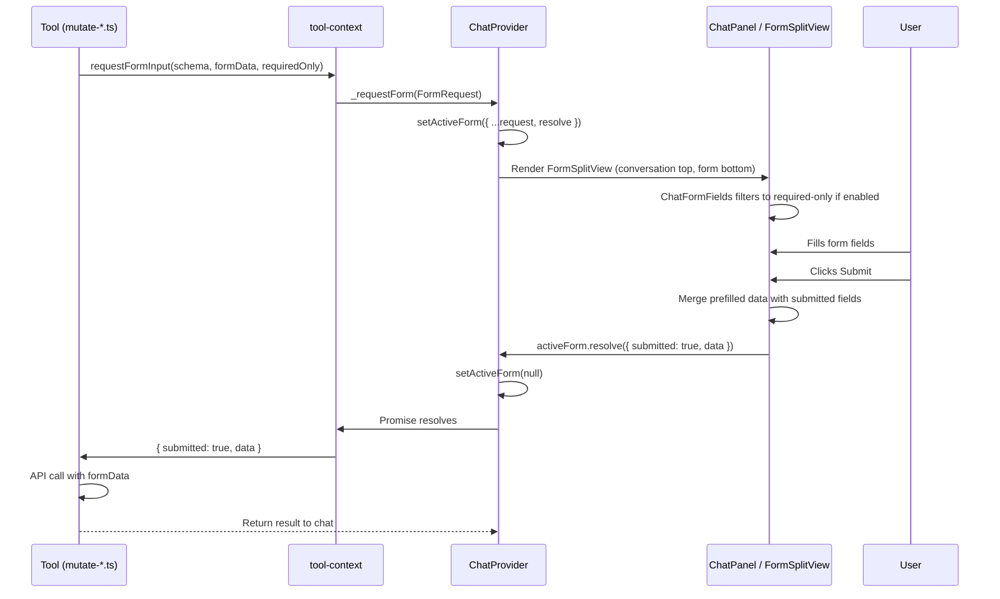
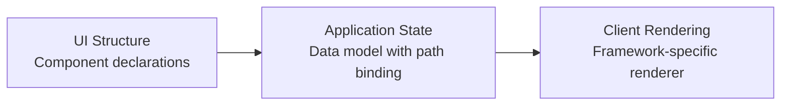
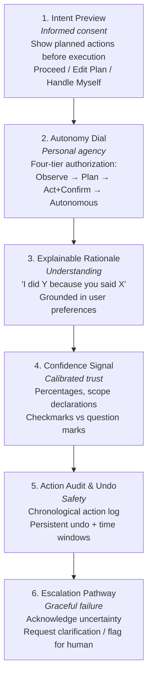
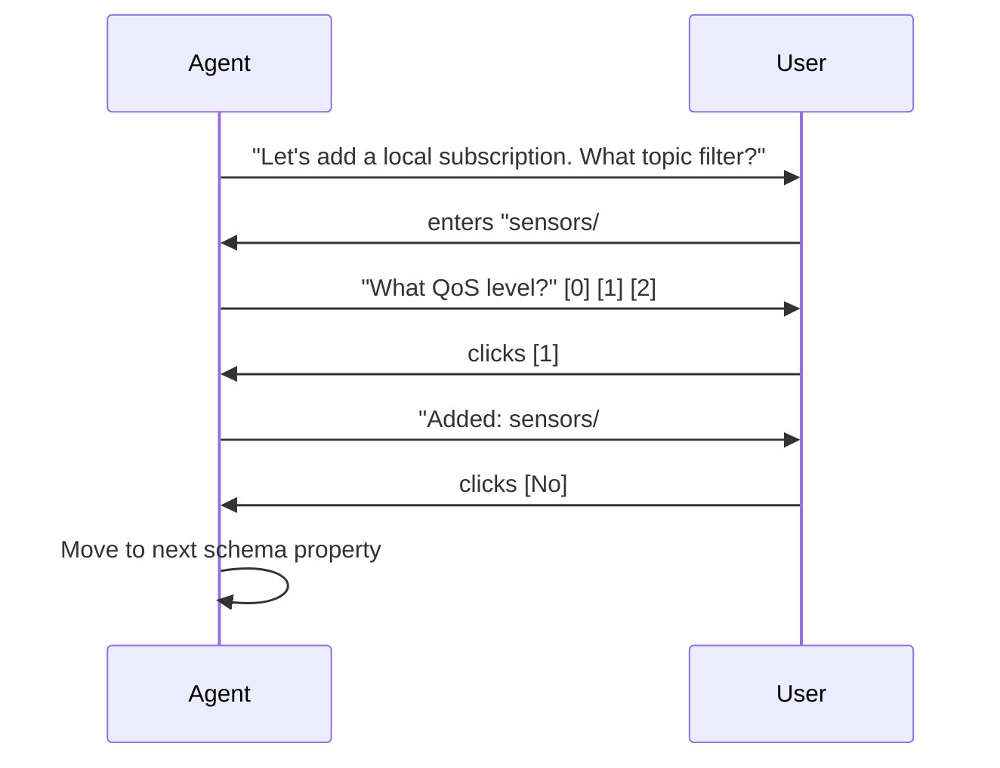
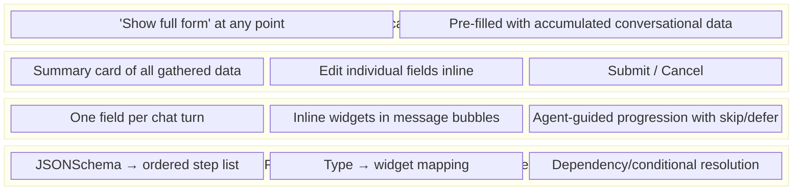
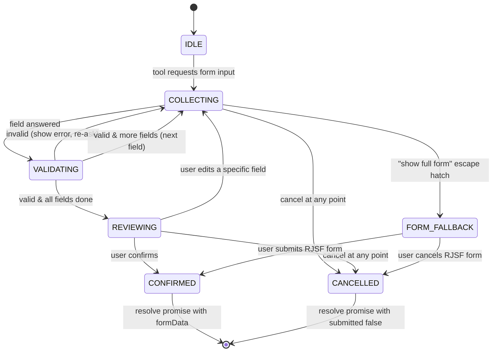
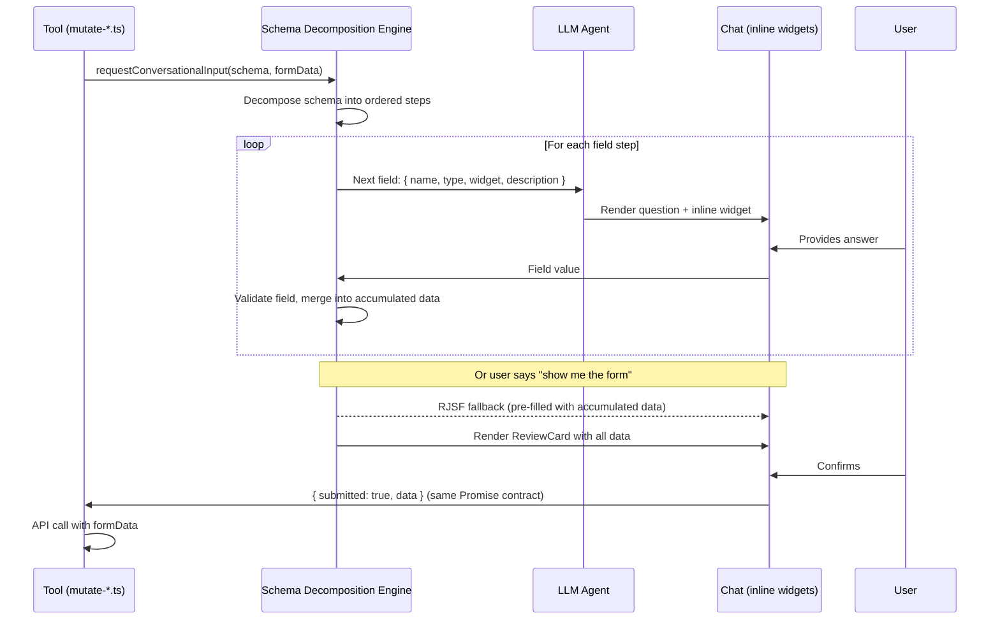

# VAN-31: Investigation Report — Conversational Data Gathering

## 1. Current State Analysis

### 1.1 Form Schema Inventory

The application uses 11 form entries across 4 mutate tools, backed by 6 static schemas + dynamic adapter schemas:

| Tool.Operation                     | Schema                        | requiredOnly | Required / Total | Complexity |
| ---------------------------------- | ----------------------------- | ------------ | ---------------- | ---------- |
| mutateBridge.create                | BridgeSchema                  | YES          | 6 / 15           | HIGH       |
| mutateBridge.update                | BridgeSchema                  | —            | all              | HIGH       |
| mutateBridge.transitionStatus      | StatusTransitionCommandSchema | —            | 0 / 1            | LOW        |
| mutateAdapter.create               | Dynamic (per adapter type)    | —            | varies           | VARIABLE   |
| mutateAdapter.update               | Dynamic (per adapter type)    | —            | varies           | VARIABLE   |
| mutateAdapter.transitionStatus     | StatusTransitionCommandSchema | —            | 0 / 1            | LOW        |
| mutateDataHub.createBehaviorPolicy | BehaviorPolicySchema          | YES          | 3 / 7            | VERY HIGH  |
| mutateDataHub.updateBehaviorPolicy | BehaviorPolicySchema          | —            | all              | VERY HIGH  |
| mutateDataHub.createDataPolicy     | DataPolicySchema              | YES          | 2 / 6            | HIGH       |
| mutateDataHub.updateDataPolicy     | DataPolicySchema              | —            | all              | HIGH       |
| mutateDataHub.createSchema         | PolicySchemaSchema            | YES          | 3 / 6            | LOW        |
| mutateDataHub.createScript         | ScriptSchema                  | YES          | 3 / 6            | LOW        |

### 1.2 Schema Complexity Ranking

| Rank | Schema                  | Nesting Depth | Array Fields             | Unbounded Objects | Worst Pain Point                                                     |
| ---- | ----------------------- | ------------- | ------------------------ | ----------------- | -------------------------------------------------------------------- |
| 1    | BehaviorPolicySchema    | 4             | 1 (onTransitions)        | 3                 | 6 optional event types, each with pipeline arrays of PolicyOperation |
| 2    | BridgeSchema            | 3             | 2 (subscriptions)        | 0                 | Nested subscription arrays with customUserProperties sub-arrays      |
| 3    | DataPolicySchema        | 3             | 2 (validators, pipeline) | 2                 | Parallel onSuccess/onFailure action paths with unbounded arguments   |
| 4    | Dynamic adapter         | varies        | varies                   | varies            | Unknown schema at design time                                        |
| 5    | PolicySchemaSchema      | 1             | 0                        | 1                 | Base64-encoded schemaDefinition                                      |
| 6    | ScriptSchema            | 0             | 0                        | 0                 | Base64-encoded source                                                |
| 7    | StatusTransitionCommand | 0             | 0                        | 0                 | Trivial (single enum)                                                |

### 1.3 Current Pain Points

**Critical:**

- BehaviorPolicy can expand to 50-100+ fields when all event types and pipelines are configured
- Array-of-objects fields (subscriptions, transitions, pipeline operations) have poor RJSF UX
- Unbounded `arguments` objects render as generic key-value editors with no type hints

**High:**

- The form split-view breaks conversational flow — user context-switches between chat and form
- Even `requiredOnly` mode shows 3-6 fields simultaneously, which is still a cognitive cliff
- No iterative array building — users must construct entire arrays in one form session

**Medium:**

- Base64 payloads (schemas, scripts) need specialized widgets
- Credential fields (TLS) render as plain text instead of password inputs
- Read-only fields (createdAt, version) should be excluded from create forms

### 1.4 Current Data Flow



---

## 2. UX Pattern Research

### 2.1 Conversational Form Patterns

#### 2.1.1 One-Question-at-a-Time (OQAAT) — Typeform

> [typeform.com/product](https://www.typeform.com/product/) | [Question types](https://www.typeform.com/surveys/question-types/)

Typeform pioneered the one-question-at-a-time pattern, presenting each question as a full-screen takeover with smooth animated transitions between steps. The core design philosophy is **reducing cognitive load by isolating a single input at a time**. They report 2-3x higher completion rates compared to traditional forms.

**Widget vocabulary:** Short text, long text, yes/no binary, rating scales (stars/hearts/smileys), Likert scales, multiple choice, picture choice (image-based selection), dropdowns, NPS (0-10), date/time pickers, file upload, and video responses.

**Visual layout:** Each question occupies the full viewport with generous whitespace. The question text appears prominently at the top, the input widget sits centered below, and a progress bar runs along the top or bottom edge. Navigation is via Enter key or an arrow button — no visible "Next" button cluttering the interface. The aesthetic is minimal and distraction-free.

**Conditional logic:** Logic jumps route users to different questions based on answers. A visual "Logic Map" provides a flowchart view of all branching paths. Calculator logic enables scoring-based branching (e.g., "if score > 50, skip to section B"). Their newer "Interaction AI" can dynamically adapt follow-up questions based on respondent context.

**Relevance to our case:** The OQAAT pattern maps directly to our proposed one-field-per-turn approach. The widget vocabulary (text, select, toggle, rating) is a useful reference for our inline chat widget taxonomy. However, Typeform's full-screen takeover is too heavy for an embedded chat — we need the same isolation principle at chat-bubble scale.

**Trade-offs:** Slower for expert users who already know what to fill; frustrating when users want to review/edit earlier answers (no random access); total time-on-task can be higher despite feeling faster.

---

#### 2.1.2 Chat-Style Progressive Collection — Landbot

> [landbot.io/features](https://landbot.io/features)

Landbot provides a visual drag-and-drop flow builder for constructing chatbot conversations that double as data collection forms. The builder uses a **node-based canvas** where each node represents a message or input step, connected by arrows that define the conversation flow.

**Visual layout:** The chat renders as a standard messaging interface — bot messages appear as left-aligned bubbles, user responses as right-aligned bubbles. Input widgets (buttons, text fields, dropdowns) appear embedded below the bot's question bubble. After the user responds, the widget is replaced by a static bubble showing their answer, and the conversation scrolls to the next question.

**Key interaction patterns:**

- Conditional branching via point-and-click configuration on the flow canvas
- Variables and formulas for storing and manipulating collected data mid-conversation
- Dynamic data connections to external sources for personalized responses
- "Human handoff" — transfer to a live agent mid-conversation via a team inbox
- Reusable "bricks" — pre-built template components for common flows (lead gen, qualification, FAQs)

**Deployment:** Four web formats (full page, popup, embed, live chat widget), plus WhatsApp and Facebook Messenger. The live chat widget format is closest to our use case — a floating panel with conversational data collection.

**Relevance to our case:** Landbot's node-based flow builder is conceptually similar to our schema decomposition engine — each schema property becomes a node. Their pattern of replacing input widgets with static answer bubbles after submission is an excellent UX detail we should adopt: once a field is answered, the widget becomes read-only text showing the confirmed value.

---

#### 2.1.3 Chat Wizard — WET-BOEW (Government of Canada)

> [Research document](https://wet-boew.github.io/wet-boew-documentation/research/2019-15-exploration-chat-pattern.html) | [JSON implementation](https://wet-boew.github.io/GCWeb/components/wb-chtwzrd/chatwizard-json-en.html) | [Source code](https://github.com/wet-boew/GCWeb/tree/master/components/wb-chtwzrd)

The WET-BOEW Chat Wizard is an open-source component that **transforms standard HTML forms into chat-like wizard experiences** while maintaining WCAG 2.0 Level AA accessibility compliance. It was deployed in production on Canada.ca's COVID-19 information pages.

**Progressive enhancement approach:** A standard HTML form exists as the baseline. The chat wizard overlays it as an enhanced experience. Users can **switch between the traditional form and chat interface at any time** without data loss. This dual-mode pattern directly validates our "escape hatch" architecture.

**JSON-driven configuration:**

```html
<section
  class="wb-chtwzrd wb-inv"
  data-wb-chtwzrd-src="path-to-json/form.json"
></section>
```

The JSON file defines questions, answer options, branching logic, greeting/farewell messages, and form action URLs. No JavaScript authoring required — the entire conversation is declarative.

**Visual layout:** On desktop (>550px), the chat renders as a floating widget in the bottom-right corner with a toggleable panel. On mobile (<550px), it goes fullscreen. The bot avatar (45x45px) appears next to each bot message. User responses appear as right-aligned bubbles. The conversation area has a scrollable history labeled "Conversation history" (screen reader accessible).

**Accessibility features:**

- Keyboard navigation with cyclic focus trapping
- Semantic HTML: `<fieldset>`, `<legend>`, `<label>` for screen readers
- Hidden headings ("Conversation history", "Conversation interaction") via `.wb-inv` class
- Visible focus indicators on all interactive elements

**Limitations (v1):** Radio buttons only (no free text, checkboxes, or selects), linear path only (no true decision trees), no back navigation, no answer editing, no skip functionality.

**Relevance to our case:** WET-BOEW is the strongest validation that JSON-driven conversational forms are feasible and accessible. Their dual-mode approach (chat ↔ form switching without data loss) is exactly our Layer 3 escape hatch. The v1 limitations (radio-only, no back navigation) are instructive — they show what a minimal viable version looks like and where to invest next.

---

#### 2.1.4 Multi-Mode Rendering — Tripetto

> [tripetto.com/sdk/react](https://tripetto.com/sdk/react/)

Tripetto offers a single JSON-based form definition that renders in **three interchangeable modes**: autoscroll (OQAAT), chat, and classic (all fields visible). The same data definition drives all three renderings, and users or the system can switch modes per context.

**Relevance to our case:** The architectural idea of one schema, multiple renderings is directly applicable. We would achieve this with JSON Schema → RJSF (classic mode) or → conversational decomposition (chat mode), using the same underlying schema. However, Tripetto's JSON format is proprietary (not JSON Schema), making it a pattern reference rather than a library candidate.

**Trade-off:** Commercial SDK; proprietary format; introduces a dependency outside our RJSF stack.

---

#### 2.1.5 Collect.chat

> [collect.chat](https://collect.chat) | [Features](https://collect.chat/features/)

Collect.chat is a no-code conversational form builder that replaces static forms with chatbot-driven data collection, claiming 3x conversion improvement. It supports range sliders, date pickers, multiple choice, rating scales, and embedded GIFs/videos within questions. Deployment via HTML snippet, WordPress plugin, or shareable link.

**Relevance to our case:** Limited — it's a hosted SaaS with no JSON Schema integration or programmatic API. Useful only as a visual reference for what conversational form interactions look like in practice.

---

### 2.2 Agentic UI Frameworks & Protocols

#### 2.2.1 Vercel AI SDK — Generative UI via Tool Results

> [Generative UI docs](https://ai-sdk.dev/docs/ai-sdk-ui/generative-user-interfaces) | [AI SDK 3.0 announcement](https://vercel.com/blog/ai-sdk-3-generative-ui) | [Human-in-the-loop cookbook](https://ai-sdk.dev/cookbook/next/human-in-the-loop) | [Multi-step & generative UI](https://vercel.com/academy/ai-sdk/multi-step-and-generative-ui)

The Vercel AI SDK (now at v6) enables LLMs to **go beyond text and generate UI** by mapping tool call results directly to React components rendered inline in the chat stream. This is the most mature and battle-tested pattern for agentic generative UI.

**How it works:** Tools are defined with Zod input schemas. When the LLM invokes a tool, the SDK renders the corresponding React component with the tool's output as props. The rendering is progressive — components show loading states while tools execute, then resolve to final UI.

**Tool definition pattern:**

```typescript
export const weatherTool = createTool({
  description: "Display the weather for a location",
  inputSchema: z.object({
    location: z.string().describe("The location to get the weather for"),
  }),
  execute: async function ({ location }) {
    return { weather: "Sunny", temperature: 75, location };
  },
});
```

**Component rendering via message parts:**

```typescript
// In the chat message renderer
if (part.type === 'tool-displayWeather') {
  switch (part.state) {
    case 'input-available':   return <div>Loading weather...</div>;
    case 'output-available':  return <Weather {...part.output} />;
    case 'output-error':      return <div>Error: {part.errorText}</div>;
  }
}
```

**React Server Components (RSC) streaming pattern:**

```jsx
tools: {
  get_city_weather: {
    description: 'Get current weather for a city',
    parameters: z.object({ city: z.string() }),
    render: async function* ({ city }) {
      yield <Spinner/>                    // Streamed loading state
      const weather = await getWeather(city)
      return <Weather info={weather} />   // Final component
    }
  }
}
```

**Three-state rendering model:** Every tool result has three states — `input-available` (loading), `output-available` (success), `output-error` (failure). This maps to our inline widget lifecycle: showing the input widget (collecting), showing the confirmed value (answered), showing validation errors (invalid).

**Human-in-the-loop:** The SDK's cookbook documents a pattern where the agent pauses execution, renders a confirmation UI component, and waits for user input before continuing. This is directly analogous to our approval card pattern and could extend to per-field confirmation.

**Relevance to our case:** We already use a similar tool-result-to-component pattern (see `tool-status.tsx`). The key takeaway is extending this to **inline form widgets as tool results** — the agent "calls a tool" that renders an input widget, waits for user input, and the input flows back as the tool result. This would keep field collection within the existing message parts architecture.

---

#### 2.2.2 CopilotKit — Component Registry & Human-in-the-Loop

> [Agentic Chat UI](https://docs.copilotkit.ai/agentic-chat-ui) | [Generative UI guide](https://docs.copilotkit.ai/guides/generative-ui) | [Human-in-the-loop](https://docs.copilotkit.ai/guides/human-in-the-loop)

CopilotKit provides a React-based agentic chat UI with a **component registry system** where developers register React components that AI agents can invoke during conversations. It distinguishes between display-only components (read-only views) and interactive components (bidirectional user input).

**Component registry hooks:**

- `useComponent` — registers React components as "frontend tool renderers in chat"
- `useRenderTool` — typed renderers for specific tool calls by name or wildcard patterns
- `useDefaultRenderTool` — fallback renderer for unhandled tool calls
- `useFrontendTool` — registers client-side tool handlers with optional UI rendering

**Five generative UI types:**

1. **Display-only components** — agent renders read-only React views (e.g., charts, tables)
2. **Interactive components** — users interact with agent-rendered UI in chat (forms, buttons)
3. **Tool rendering** — custom components visualize backend tool results
4. **State rendering** — real-time visualization of agent state changes
5. **MCP apps** — interactive components streamed from Model Context Protocol servers

**Human-in-the-loop hooks:**

- `useHumanInTheLoop` — interactive tools that **pause agent execution** and wait for user input
- `useInterrupt` — handles agent interrupt events and resumes with user-supplied input
- LangGraph integration for interrupt-based HITL workflows

**Relevance to our case:** The component registry pattern is the most directly applicable idea. We could define a small registry of chat-embeddable input widgets (`ChatTextField`, `ChatSelectField`, etc.) that the schema decomposition engine maps to. The `useHumanInTheLoop` pattern parallels our `requestFormInput` Promise-based mechanism. CopilotKit validates that this architecture works at scale — but we wouldn't adopt the framework itself, just the patterns.

---

#### 2.2.3 A2UI (Google) — Declarative Agent UI Protocol

> [What is A2UI?](https://a2ui.org/introduction/what-is-a2ui/)

A2UI (Agent-to-User Interface) is a declarative UI protocol where AI agents generate rich, interactive UIs by **emitting JSON component declarations from a trusted catalog**, rather than generating executable code. This eliminates code-execution security risks.

**Three-layer architecture:**



- **Surface**: Named canvas for UI (dialogs, sidebars, main views)
- **Component**: UI elements — Button, TextField, Card, DateTimeInput, Text — referenced by ID
- **Data Model**: Application state with path-based binding (e.g., `"/booking/date"`)
- **Catalog**: Registry of available component types, trusted and controlled by the client

**Key design principles:**

- **Declarative, not executable**: Agent emits JSON descriptions, never code. The client controls rendering.
- **LLM-friendly**: Flat component lists with ID references — easy for LLMs to generate incrementally and stream.
- **Framework-agnostic**: One A2UI payload renders across React, Angular, Flutter, SwiftUI.
- **Catalog-constrained**: Agents can only request components from the client's pre-approved catalog.

**Message types:** `surfaceUpdate` (add/modify components), `dataModelUpdate` (change state), `beginRendering` (signal the client to start rendering).

**Relevance to our case:** The catalog pattern maps directly to our Chakra UI component library. We could define an "agent-renderable catalog" — a subset of our components (text inputs, selects, toggles, cards) that the schema decomposition engine can compose. The declarative JSON approach also means we could potentially let the LLM generate inline widget configurations without security concerns, since it can only reference pre-approved component types.

---

#### 2.2.4 AG-UI Protocol — Bidirectional Agent-UI Communication

> [Introduction](https://docs.ag-ui.com/introduction) | [Events](https://docs.ag-ui.com/concepts/events)

AG-UI is an open, event-based protocol for **bidirectional communication between AI agents and frontend applications**. It positions itself as the "Agent-to-User" layer in the emerging agent protocol stack:

| Layer           | Protocol        | Purpose                         |
| --------------- | --------------- | ------------------------------- |
| Agent <-> User  | **AG-UI**       | Event-based frontend connection |
| Agent <-> Tools | MCP (Anthropic) | External system connections     |
| Agent <-> Agent | A2A (Google)    | Distributed agent coordination  |

**Seven event categories:**

1. **Lifecycle**: `RunStarted`, `RunFinished`, `RunError`, `StepStarted`, `StepFinished`
2. **Text Message**: `TextMessageStart/Content/End/Chunk` — streaming text delivery
3. **Tool Call**: `ToolCallStart/Args/End/Result/Chunk` — progressive tool invocation
4. **State Management**: `StateSnapshot`, `StateDelta` (RFC 6902 JSON Patch) — state sync
5. **Activity**: `ActivitySnapshot`, `ActivityDelta` — in-progress work visualization
6. **Reasoning**: `ReasoningStart/Content/End` + `ReasoningEncryptedValue` — chain-of-thought
7. **Special**: `Raw` (external events), `Custom` (extension points)

**State synchronization:** Uses a snapshot-delta pattern. The agent sends a full `StateSnapshot`, then incremental `StateDelta` events as RFC 6902 JSON Patch operations. This maps well to our partial form data accumulation — each field answer could be a delta patch on the accumulated formData object.

**Generative UI support:** Two modes — **static** (render model output as stable, typed components under app control) and **declarative** (small declarative language for constrained yet open-ended agent UIs).

**Human-in-the-loop:** "Pause, approve, edit, retry, or escalate mid-flow without losing state."

**Relevance to our case:** AG-UI's state delta pattern (JSON Patch for incremental updates) is an elegant model for our form data accumulation. Rather than merging objects, each field answer could be expressed as a patch operation. The protocol's lifecycle events also provide a clean model for our state machine (RunStarted → StepStarted → field collection → StepFinished → next field → RunFinished).

---

#### 2.2.5 Thesys C1 — LLM-to-Structured-UI API

> [thesys.dev](https://www.thesys.dev) | [Documentation](https://docs.thesys.dev/)

Thesys provides an OpenAI-compatible API endpoint that returns structured UI components instead of text. The LLM generates the UI structure (inputs, selects, buttons), and form data is submitted back to the assistant through defined tools. It's positioned as a drop-in replacement for the OpenAI chat completions API.

**Relevance to our case:** The pattern — "LLM generates UI structure, form data flows back as tool input" — is the fundamental loop we're designing. However, Thesys is an external service dependency we wouldn't adopt directly. The conceptual model is the key takeaway.

---

### 2.3 Inline Chat Widget Patterns

#### 2.3.1 CometChat FormBubble

> [Interactive Messages docs](https://www.cometchat.com/docs/sdk/android/interactive-messages)

CometChat's Interactive Messages system enables structured forms to render directly within chat bubbles. An `InteractiveMessage` object carries `interactiveData` as a JSON payload:

```json
{
  "title": "Registration Form",
  "formFields": [
    { "elementType": "textInput", "elementId": "name", "label": "Full Name" },
    { "elementType": "dropdown", "elementId": "role", "label": "Role", "options": [...] }
  ],
  "submitElement": { "elementType": "button", "text": "Submit", "action": { ... } }
}
```

**Visual design guidelines:**

- Max-width of 70-75% of the chat container (prevents bubbles from spanning full width)
- Rounded corners (18px border-radius) for visual consistency with text bubbles
- Slightly larger horizontal padding than vertical (12px 16px)
- After submission, the form widget is **replaced by a confirmation summary** — the form becomes read-only, showing what was submitted

**Interaction tracking:** `markAsInteracted()` API, with goal-based completion detection (any interaction, specific interaction, all interactions, none). Event listeners for `onInteractiveMessageReceived()` and `onInteractionGoalCompleted()`.

**Relevance to our case:** The visual design guidelines (max-width, border-radius, padding) and the "replace with confirmation" pattern are directly applicable to our inline widget design. The JSON payload structure is similar to what our schema decomposition engine would produce.

#### 2.3.2 Google Chat Interactive Cards

Google Chat allows adding interactive UI elements (text inputs, selection inputs, date/time pickers, buttons) to card-based messages. Each widget has an `onChangeAction` that sends form data back to the app. Cards have a structured layout with sections, headers, and widget rows.

**Relevance to our case:** The card-based approach with structured action callbacks is a clean model. Each field in our conversational flow could be a lightweight card with the question, input widget, and confirm action.

---

### 2.4 Agentic AI UX Design Patterns

#### 2.4.1 Smashing Magazine — Designing for Agentic AI (Feb 2026)

> [Full article](https://www.smashingmagazine.com/2026/02/designing-agentic-ai-practical-ux-patterns/)
> Author: Victor Yocco, PhD (UX researcher, Allelo Design)

This article defines six core UX patterns for trustworthy autonomous AI systems, framing agentic AI design as **"architecting relationships" rather than building interfaces**. Each pattern addresses a specific psychological need:



**Intent Preview** is the most relevant pattern for our conversational forms. Before executing a multi-step action, the agent presents its planned sequence: "I'll create a bridge with these settings: [summary]. Proceed / Edit / Cancel." The target metric is >85% acceptance rate.

**Autonomy Dial** defines four progressive authorization tiers:

1. Observe & Suggest — agent recommends, user acts
2. Plan & Propose — agent drafts a plan, user approves
3. Act with Confirmation — agent executes after explicit approval
4. Act Autonomously — agent executes pre-approved low-risk tasks

**Implementation roadmap:**

- Phase 1 (Foundational): Intent Preview + Action Audit
- Phase 2 (Calibrated): Autonomy Dial + Explainable Rationale
- Phase 3 (Proactive): Full autonomous execution for pre-approved tasks

**Relevance to our case:** Our ReviewCard (showing accumulated data before submission) is an Intent Preview. Our ApprovalCard is already implementing the "Act with Confirmation" tier. The conversational form flow adds the "Plan & Propose" tier — the agent proposes field values one at a time, the user confirms or adjusts each, building toward a complete configuration collaboratively.

---

#### 2.4.2 Conversation vs. Form Decision Framework

> Sources: [Enterprise Agentic UX](https://medium.com/design-bootcamp/agentic-ux-in-enterprise-when-to-use-conversational-agents-vs-traditional-forms-93cf588eac21) | [Intercom: Why Forms Aren't Dead Yet](https://www.intercom.com/blog/why-forms-arent-dead-yet/) | [NN/g Progressive Disclosure](https://www.nngroup.com/articles/progressive-disclosure/)

Research from Lana Holston (Medium/Bootcamp) and Intercom's design team identifies clear criteria for choosing between conversational and form-based data collection:

| Use Conversation When                                       | Use Form When                                    |
| ----------------------------------------------------------- | ------------------------------------------------ |
| Low-frequency, unfamiliar task (first-time setup)           | Frequent, well-understood task (reconfiguration) |
| High conditionality (next field depends on previous)        | Fields are independent, fillable in any order    |
| Task benefits from explanation alongside each field         | Expert user who knows the schema                 |
| Few fields (≤5 required properties)                         | Many fields visible simultaneously for review    |
| Array building (iterative "add another?")                   | Bulk data entry                                  |
| Navigation is the challenge (user doesn't know where to go) | User explicitly requests the form                |

**The "Conversation to Start, Form to Finish" hybrid pattern** is the most recommended approach across sources:

1. Agent asks 2-3 key questions conversationally (type, endpoint, identity)
2. Agent pre-fills a form with intelligent defaults based on those answers
3. Full form rendered for the user to review and adjust
4. User submits; agent confirms and executes

This aligns with our proposed Layer 1 (conversational collection) → Layer 2 (review card) → Layer 3 (escape to full form) architecture.

---

### 2.5 JSON Schema → Conversational Flow

No mature, widely-adopted library exists that directly converts a JSON Schema into a conversational chat flow. The closest approaches:

| Approach                                                                                             | Description                                           | Gap                                                 |
| ---------------------------------------------------------------------------------------------------- | ----------------------------------------------------- | --------------------------------------------------- |
| RJSF multi-step wizard (issue [#464](https://github.com/rjsf-team/react-jsonschema-form/issues/464)) | Community pattern splitting schema by top-level props | Not conversational; still traditional form per step |
| WET-BOEW Chat Wizard                                                                                 | JSON-driven chat wizard, WCAG compliant               | Custom JSON format, not JSON Schema                 |
| Form.io wizard mode                                                                                  | `display: "wizard"` on JSON schema forms              | Proprietary schema extensions                       |
| Tripetto ChatRunner                                                                                  | JSON definition → chat-style rendering                | Proprietary format, not JSON Schema                 |

**Conclusion:** The conversion layer must be built custom. The schema decomposition engine is novel — decomposing JSON Schema properties into ordered conversational steps with widget type mapping. However, the individual pieces (one-field-at-a-time UX, inline widgets, agent-controlled progression) are all well-established patterns from the sources above.

---

## 3. Schema Decomposition Strategy

### 3.1 Property-to-Step Mapping

Each JSON Schema property maps to a conversational step:

| JSON Schema Type                 | Chat Widget                                  | Interaction             |
| -------------------------------- | -------------------------------------------- | ----------------------- |
| `string`                         | Text input                                   | Type + confirm          |
| `string` with `enum`             | Button group or select                       | Click to choose         |
| `integer` / `number`             | Number input                                 | Type + confirm          |
| `boolean`                        | Toggle or Yes/No buttons                     | Click to choose         |
| `string` with `format: password` | Password input                               | Type + confirm          |
| `object` (nested)                | Sub-conversation or inline mini-form         | Recursive decomposition |
| `array` of primitives            | Multi-select or iterative "add another?"     | Loop                    |
| `array` of objects               | Iterative sub-conversation per item          | "Add another?" loop     |
| `oneOf` / `anyOf`                | Discriminator select → conditional follow-up | Branch                  |

### 3.2 Ordering Strategy

1. **Required fields first**, in `ui:order` sequence (or schema `properties` order as fallback)
2. **Agent-guided optional fields**: after required fields, the agent asks "Would you like to configure [optional group]?" (e.g., "TLS settings", "subscriptions")
3. **Dependent fields**: fields with `dependencies` or `if/then` are deferred until their dependency is satisfied
4. **Read-only fields**: excluded entirely from conversational flow

### 3.3 Nested Object Handling

Two strategies depending on depth:

- **Shallow objects** (1 level, ≤3 properties): Flatten into the main conversation as grouped questions with a label ("Now let's configure TLS...")
- **Deep objects** (2+ levels or >3 properties): Present as a named sub-conversation or offer a mini-form card

### 3.4 Array Handling



Each array item follows the item schema's decomposition. The agent maintains a running list and offers review before moving on.

---

## 4. Architecture Proposal

### 4.1 Layered Approach



### 4.2 State Machine



### 4.3 Component Taxonomy

New chat-embeddable components (rendered as message parts):

| Component           | Maps From             | Renders                                       |
| ------------------- | --------------------- | --------------------------------------------- |
| `ChatTextField`     | string                | Text input + confirm button inside bubble     |
| `ChatNumberField`   | integer/number        | Number input with stepper + confirm           |
| `ChatSelectField`   | string with enum      | Button group (≤5 options) or dropdown (>5)    |
| `ChatToggleField`   | boolean               | Yes/No button pair or toggle switch           |
| `ChatPasswordField` | string (password)     | Masked input + confirm                        |
| `ChatReviewCard`    | full accumulated data | Read-only summary with edit buttons per field |
| `ChatArrayPrompt`   | array                 | "Add another?" with item count badge          |

These render within the existing `message-bubble.tsx` as a new part type (e.g., `type: "form-field"`).

### 4.4 Agent Orchestration

Two viable approaches for controlling field progression:

#### Option A: Schema-Driven (Deterministic)

- The schema decomposition engine produces an ordered step list at the start
- The agent follows the list mechanically, skipping optional fields unless the user asks
- **Pros:** Predictable, no LLM variability, works offline
- **Cons:** Rigid, can't adapt to user context ("I already have TLS certs set up")

#### Option B: LLM-Driven (Adaptive)

- The agent receives the schema and accumulated data as context
- It decides which field to ask next based on conversation history and user intent
- It can skip, reorder, group, or explain fields dynamically
- **Pros:** Natural, context-aware, can handle "fill these three fields at once"
- **Cons:** LLM latency per step, potential inconsistency, harder to test

#### Recommended: Hybrid (Option C)

- Schema decomposition engine produces the default step order and widget mappings
- The agent follows the default order but can deviate based on conversation context
- The engine enforces validation and completeness regardless of order
- **Pros:** Predictable baseline with adaptive flexibility; engine guarantees data integrity

### 4.5 Integration with Existing Pipeline

The conversational form flow replaces the middle of the current pipeline while preserving the same Promise contract — **tools don't need to change**.



### 4.6 Impact on Existing Code

| Component                           | Change Required                                                           |
| ----------------------------------- | ------------------------------------------------------------------------- |
| Tool implementations (mutate-\*.ts) | None — same Promise interface                                             |
| `tool-context.ts`                   | Add `requestConversationalInput` alongside existing `requestFormInput`    |
| `chat-context.tsx`                  | New state machine for conversational collection mode                      |
| `chat-panel.tsx`                    | New rendering mode (inline widgets instead of FormSplitView)              |
| `message-bubble.tsx`                | Support new part types for inline widgets                                 |
| `form-schemas.ts`                   | Add metadata for conversational mode (field descriptions, grouping hints) |
| `schema-form.tsx`                   | No change (used as fallback)                                              |

---

## 5. Edge Cases

### 5.1 Deeply Nested Objects

- BehaviorPolicyOnTransition has 4 levels of nesting
- **Mitigation:** Flatten to 2 levels max in conversation; deeper structures get mini-form cards

### 5.2 Large Arrays

- Bridge subscriptions could have 10+ items
- **Mitigation:** After 3 items, offer "add more in form view" escape hatch

### 5.3 Conditional Fields

- DataPolicy's onSuccess/onFailure depend on whether validation is configured
- **Mitigation:** Schema decomposition engine tracks dependencies; deferred fields only appear after their condition is met

### 5.4 Unbounded Objects (additionalProperties)

- PolicyOperation.arguments has no fixed schema
- **Mitigation:** Render as a JSON editor widget or key-value pair builder; consider providing argument templates per known function

### 5.5 Edit Mode (Update Operations)

- All fields already have values; re-asking each one is tedious
- **Mitigation:** For updates, default to form view; conversational mode only for specific field edits ("change the port to 8883")

### 5.6 Undo / Back Navigation

- User wants to change a previous answer mid-conversation
- **Mitigation:** ReviewCard allows editing any field; alternatively, user says "go back to host" and the agent re-asks that field

### 5.7 Base64 Payloads

- schemaDefinition and script source need encoding
- **Mitigation:** Provide a multi-line text input with automatic base64 encoding on submit

### 5.8 Validation Errors at Submission

- Individual fields pass validation but the combined object fails (cross-field constraints)
- **Mitigation:** ReviewCard runs full schema validation before final submission; errors link back to specific fields

---

## 6. Recommendations

### 6.1 Phased Rollout

**Phase 1 — Simple schemas first**

- Implement conversational flow for StatusTransitionCommand (1 field) and PolicySchema/Script (3 required fields)
- Build the core infrastructure: schema decomposition engine, inline widget components, state machine
- Validate the UX pattern with the simplest cases

**Phase 2 — Medium schemas**

- Extend to BridgeSchema (create mode, 6 required fields)
- Add array handling for subscriptions with "add another?" loop
- Implement the ReviewCard confirmation step
- Add "show full form" escape hatch

**Phase 3 — Complex schemas**

- Extend to DataPolicy and BehaviorPolicy
- Implement conditional field handling and nested object decomposition
- Add the LLM-adaptive ordering (Hybrid Option C)

**Phase 4 — Polish**

- Edit mode (update operations) with targeted field modification
- Keyboard shortcuts and accessibility audit
- Animation and transition polish
- Usage analytics to measure completion rates vs. old form flow

### 6.2 Key Design Decisions to Make Before Implementation

1. **Where do inline widgets render?** As new message parts in the existing bubble system, or as a persistent input area below the chat (like the current ChatInput)?
2. **Who controls progression — the LLM or the engine?** Start with engine-driven (Phase 1-2), add LLM flexibility later (Phase 3).
3. **How granular are the steps?** One property per step, or group related properties (e.g., host + port together)?
4. **How does the review card render?** Inline in chat as a large bubble, or in a slide-over panel?
5. **Should conversational mode be the default or opt-in?** Recommend: default for create operations, form-view default for update operations.

---

## Sources

- Typeform progressive profiling patterns
- Landbot conversational form design guides
- WET-BOEW Chat Wizard (Government of Canada) — JSON-driven, WCAG-compliant
- Vercel AI SDK v6 — tool-result-to-component, human-in-the-loop cookbook
- CopilotKit — component registry, agentic chat UI
- Google A2UI — declarative agent UI protocol
- Thesys C1 — LLM-to-structured-UI API
- CometChat FormBubble — inline chat form widgets
- RJSF issue #464 — multi-step wizard patterns
- Smashing Magazine (Feb 2026) — Agentic AI UX patterns for control, consent, accountability
- NN/g, IxDF — Progressive disclosure research
- Intercom — "Why Forms Aren't Dead Yet"
- Enterprise Agentic UX — conversational agents vs. traditional forms decision framework
