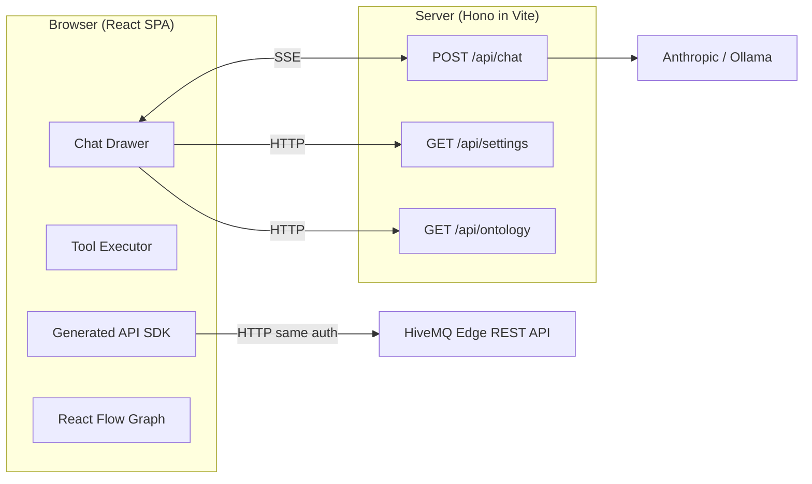

# HiveMQ Edge Agentic

An AI-powered management interface for [HiveMQ Edge](https://www.hivemq.com/products/hivemq-edge/), the IoT gateway that bridges industrial protocols to MQTT. A conversational AI assistant can query, visualize, and mutate every resource in the system — with explicit user approval for all changes.

## What It Does

- **Chat-driven management** — ask the assistant to list bridges, inspect adapter status, create resources, or explain the system topology. Eleven tools give it full read/write access to the HiveMQ Edge REST API.
- **Inline forms with approval** — mutations never happen silently. The assistant shows a pre-filled form for creates/updates and an approval card for deletes. The user reviews and confirms before anything changes.
- **Interactive domain graph** — visualize the full entity topology (adapters, bridges, topics, policies) as an interactive React Flow canvas. Scoped views filter by concern: data flow, adapter topology, bridge topology, policy impact.
- **Multi-provider AI** — swap between Anthropic Claude (cloud) and Ollama (local) without code changes. OpenAI, Google Gemini, and OpenRouter are drop-in additions.
- **Schema-driven UI** — forms are rendered from JSON schemas produced by the OpenAPI spec. No hand-coded forms.

## Quick Start

### Prerequisites

- **Node.js** 20+
- **pnpm** 9+
- **HiveMQ Edge** running locally (default: `http://localhost:8080`)
- **Anthropic API key** or **Ollama** running locally

### Install & Run

```bash
git clone <repo-url> && cd hivemq-edge-agentic
pnpm install

# Configure your AI provider
cp .env.example .env
# Edit .env — set ANTHROPIC_API_KEY or AI_PROVIDER=ollama

pnpm dev
```

Open `http://localhost:5173`. Log in with HiveMQ Edge credentials. The chat assistant is accessible via the toolbar icon or `Ctrl+K` / `Cmd+K`.

### Development Mode

MSW (Mock Service Worker) intercepts API calls in dev, so the app works without a live HiveMQ Edge instance. Mock data in `src/mocks/` provides realistic responses for all endpoints.

## Configuration

### AI Provider

Configure via `.env` or the in-app settings UI (gear icon).

| Variable            | Default                  | Description                        |
| ------------------- | ------------------------ | ---------------------------------- |
| `AI_PROVIDER`       | `anthropic`              | `anthropic` or `ollama`            |
| `ANTHROPIC_API_KEY` | —                        | Required for Anthropic             |
| `ANTHROPIC_MODEL`   | `claude-sonnet-4-5`      | Any Claude model ID                |
| `OLLAMA_HOST`       | `http://localhost:11434` | Ollama server URL                  |
| `OLLAMA_MODEL`      | `qwen3:8b`               | Any Ollama model with tool support |

Settings changed in the UI (localStorage) override `.env` values and take effect on the next chat message.

### Supported Providers

| Provider             | Status             | Best Model          | Cost            |
| -------------------- | ------------------ | ------------------- | --------------- |
| **Anthropic Claude** | Primary            | `claude-sonnet-4-5` | $3.00 / MTok in |
| **Ollama (local)**   | Experimental       | `qwen3:8b`          | Free            |
| Google Gemini        | Not yet integrated | Gemini 2.5 Flash    | $0.30 / MTok in |
| OpenAI               | Not yet integrated | GPT-4o-mini         | $0.15 / MTok in |
| OpenRouter           | Not yet integrated | 400+ models         | Varies          |

Adding a new provider: `pnpm add @tanstack/ai-<provider>` + a new branch in `server/api/chat.ts:resolveAdapterFromSettings()`.

### Ollama Setup (Apple Silicon)

```bash
# Enable Flash Attention + KV cache quantization
OLLAMA_FLASH_ATTENTION=1 OLLAMA_KV_CACHE_TYPE=q8_0 ollama serve

ollama pull qwen3:8b
```

> Ollama support is experimental. Even with adapter workarounds, smaller models (7B/8B) have unreliable tool calling. Anthropic Claude remains recommended for production use.

## Architecture

The AI layer is built on [TanStack AI](https://tanstack.com/ai) with the [AG-UI protocol](https://docs.ag-ui.com/). The server streams LLM responses via SSE; the browser executes tool calls client-side using the generated API SDK — keeping the server stateless and the user's auth context in control.



**Key decision**: the server only proxies LLM calls. Tool execution happens entirely in the browser, where the generated API client calls HiveMQ Edge directly. The assistant works with the same authentication and permissions as the logged-in user.

For the full architecture documentation (Mermaid diagrams, tool system, AG-UI protocol, security model), see [`server/about.md`](server/about.md).

## Build Commands

| Command             | Description                             |
| ------------------- | --------------------------------------- |
| `pnpm dev`          | Dev server with HMR                     |
| `pnpm build`        | Production build (`dist/`)              |
| `pnpm lint`         | ESLint                                  |
| `pnpm format:write` | Prettier                                |
| `pnpm api:generate` | Regenerate API client from OpenAPI spec |

## Technology Stack

| Layer      | Technology              | Purpose                              |
| ---------- | ----------------------- | ------------------------------------ |
| UI         | React 19 + Chakra UI v3 | Component rendering                  |
| Types      | TypeScript 5.9          | Static typing (`erasableSyntaxOnly`) |
| Build      | Vite 7                  | Dev server + bundling                |
| Routing    | TanStack Router         | File-based, type-safe routing        |
| AI         | TanStack AI             | Provider-agnostic LLM streaming      |
| API Client | @hey-api/openapi-ts     | Generated from OpenAPI spec          |
| Forms      | RJSF + Chakra UI theme  | Schema-driven form rendering         |
| Graph      | React Flow + WebCola    | Interactive topology visualization   |
| Mocking    | MSW + @msw/data         | Browser-level API interception       |
| Server     | Hono                    | Lightweight HTTP (embedded in Vite)  |
| i18n       | react-i18next           | Internationalization                 |

---

## How This Was Built

### The Vibe Coding Experiment

This application was built almost entirely through AI-human collaboration — an experiment in what's sometimes called "vibe coding." The codebase, from initial scaffold to interactive graph visualization, was designed and implemented through conversation between a developer and Claude (Anthropic's AI assistant), using [Claude Code](https://claude.ai/code) as the development interface.

The process wasn't "AI writes code, human reviews." It was **co-design**:

- **The human** provided domain expertise (HiveMQ Edge, IoT protocols, MQTT), set product direction, identified UX problems, and challenged architectural decisions.
- **The AI** explored the codebase, proposed implementation approaches, wrote and debugged code, discovered spec inconsistencies, and adapted to feedback in real-time.
- **Neither worked alone.** Every significant feature went through a plan-discuss-implement-refine cycle. The AI proposed plans; the human pushed back, redirected, or approved. The human spotted visual bugs from screenshots; the AI traced them to root causes in code.

### What Emerged

Several patterns emerged naturally from this workflow:

- **Task-based planning** — every feature lives in `.tasks/<id>-<slug>/` with a brief (what the user wants), a plan (what the AI will do), and progress checkboxes. This gave both parties a shared reference point and prevented scope drift.
- **Spec-as-source-of-truth (with caveats)** — the OpenAPI spec was treated as ground truth for the domain model. When the AI discovered gaps (missing required fields, copy-paste errors, undocumented relationships), they were catalogued in [`.tasks/SPEC_REVIEW.md`](.tasks/SPEC_REVIEW.md) and worked around locally — never silently ignored.
- **Incremental ontology co-design** — the domain ontology (the AI's knowledge of HiveMQ Edge) couldn't be derived from the spec alone. It was built iteratively: the AI proposed a model, the human corrected misconceptions about adapter types and data flow, and the ontology was refined over multiple sessions. See [`.tasks/DOMAIN_ONTOLOGY.md`](.tasks/DOMAIN_ONTOLOGY.md).
- **Screenshot-driven debugging** — the human shared browser screenshots; the AI read them (multimodal) and identified layout issues, overflow bugs, and visual regressions without needing to run the app.

### Contributing with AI

If you're extending this codebase with Claude Code or similar tools:

1. **Read [`.tasks/CONVENTIONS.md`](.tasks/CONVENTIONS.md)** — defines the task tracking structure all agents must follow.
2. **Check [`CLAUDE.md`](CLAUDE.md)** — project-level instructions loaded automatically by Claude Code. Documents build commands, architecture, and coding constraints.
3. **Use the task system** — create a `.tasks/<id>-<slug>/` folder with `TASK_BRIEF.md` and `TASK_PLAN.md` before starting work.
4. **Challenge the spec** — if the API behaves differently from the OpenAPI spec, document the discrepancy in [`SPEC_REVIEW.md`](.tasks/SPEC_REVIEW.md) and add a `// TEMP FIX` comment in code with a reference.

---

## Known Upstream Issues

The HiveMQ Edge OpenAPI specification has quality gaps that required workarounds in this project. The comprehensive review is in [`.tasks/SPEC_REVIEW.md`](.tasks/SPEC_REVIEW.md).

Key issues affecting this application:

- **Incomplete domain model** — the spec lacks relationship information between entities (which adapter owns which tags, how bridges relate to topic filters). The domain ontology had to be built through iterative co-design rather than automated extraction. See [`.tasks/DOMAIN_ONTOLOGY.md`](.tasks/DOMAIN_ONTOLOGY.md).
- **Missing `required` fields causing runtime failures** — `Adapter.config` and `Adapter.type` are not marked required in the spec, but the API rejects payloads without them (400 `AdapterFailedValidation`). Workaround: `src/agent/form-schemas.ts` overrides the required array. Tagged with `// TEMP FIX`.
- **No security declarations** — the spec contains no `securitySchemes` despite JWT-based auth. Public vs authenticated endpoints were determined empirically.
- **Copy-paste errors** — 12+ endpoint descriptions reference wrong entities (e.g., events endpoint says "get all bridges").
- **Inconsistent HTTP semantics** — Data Hub endpoints follow REST conventions; Edge-native endpoints return 200 OK with empty bodies for all operations.
