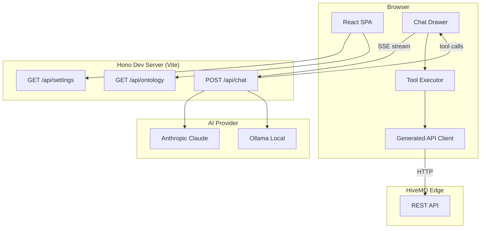
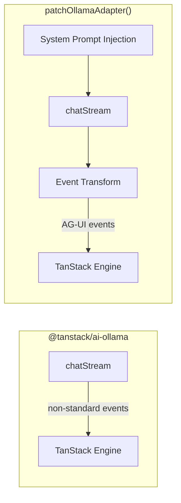
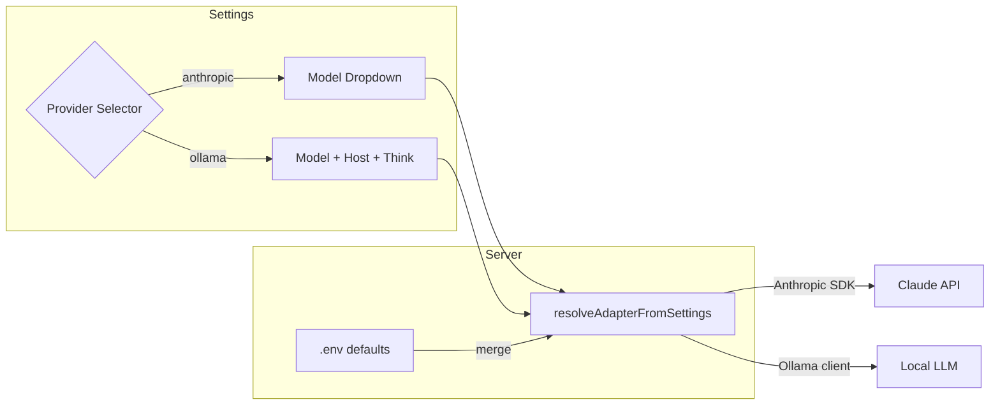
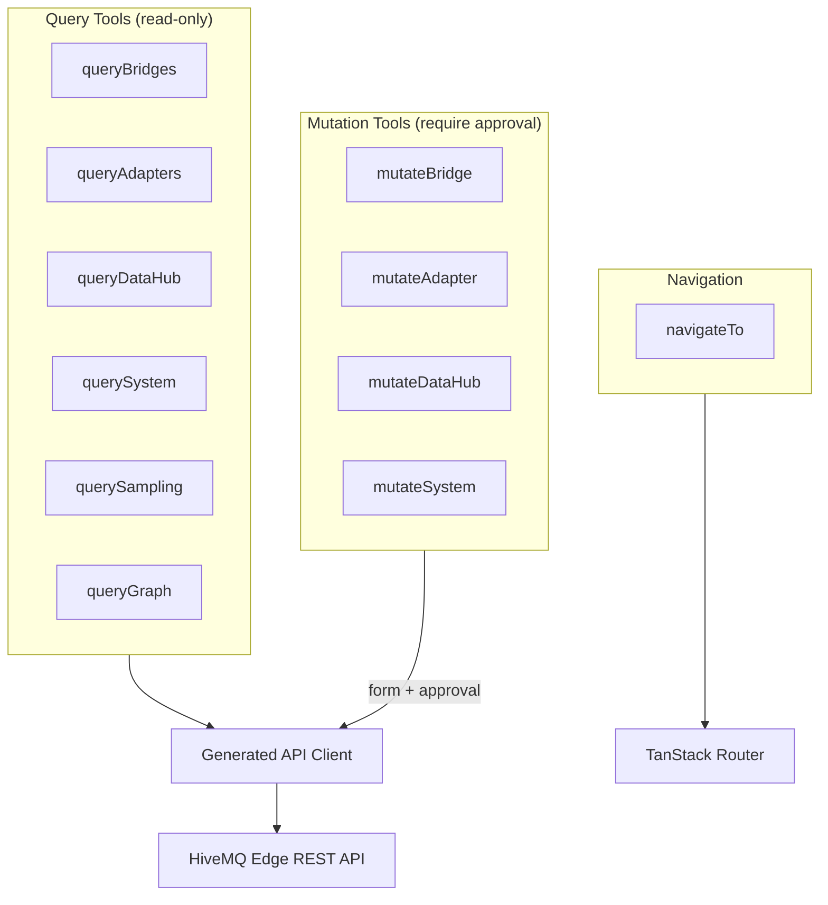
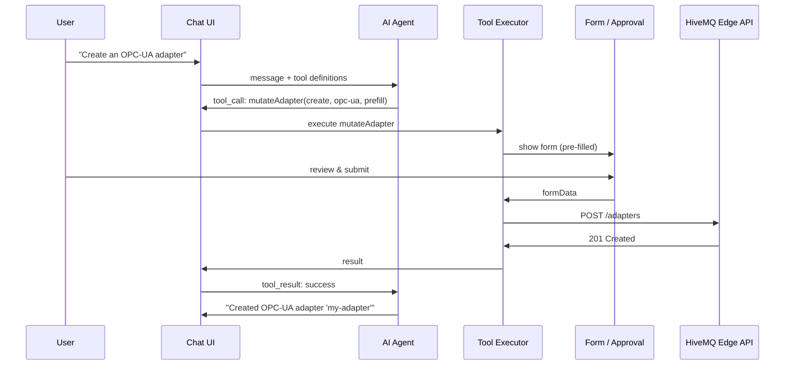

# HiveMQ Edge Agentic

An AI-powered management interface for HiveMQ Edge, the IoT gateway. This application augments the standard REST API with a conversational AI assistant that can query, visualize, and mutate every resource in the system — with explicit user approval for all changes.

## Table of Contents

- [Architecture Overview](#architecture-overview)
- [Build Phases](#build-phases)
- [TanStack AI Framework](#tanstack-ai-framework)
  - [What It Provides](#what-it-provides)
  - [The AG-UI Protocol](#the-ag-ui-protocol)
  - [Upstream Issues & Workarounds](#upstream-issues--workarounds)
  - [Ollama Adapter Patch](#ollama-adapter-patch)
- [Model Providers](#model-providers)
  - [Anthropic Claude (Primary)](#anthropic-claude-primary)
  - [Ollama (Local)](#ollama-local)
  - [Not Yet Integrated](#not-yet-integrated)
  - [Provider Comparison](#provider-comparison)
- [AI Provider Architecture](#ai-provider-architecture)
- [Tool System](#tool-system)
  - [Query Tools](#query-tools)
  - [Mutation Tools](#mutation-tools)
  - [Mutation Flow](#mutation-flow)
- [Technology Stack](#technology-stack)
- [System Prompt & Context Budget](#system-prompt--context-budget)
- [Security Model](#security-model)
- [Future Directions](#future-directions)

---

## Architecture Overview



The key architectural decision: **the server only proxies LLM calls**. Tool execution happens entirely in the browser, where the generated API client calls HiveMQ Edge directly. This means the AI assistant works with the same authentication and permissions as the logged-in user.

---

## Build Phases

The system was built incrementally across nine phases, each adding a layer of capability.

```mermaid
gantt
  title Build Phases
  dateFormat X
  axisFormat %s

  section Foundation
  Core Application        :done, t1, 0, 1
  OpenAPI Client & Mocks  :done, t2, 1, 2
  JSON Schema Forms       :done, t3, 2, 3
  Internationalization    :done, t4, 3, 4

  section Intelligence
  Domain Ontology         :done, t5, 4, 5
  AI Agent & Tools        :done, t6, 5, 6
  Graph Visualization     :done, t7, 6, 7

  section Refinement
  Modular Ontology        :done, t8, 7, 8
  Settings System         :done, t9, 8, 9
```



### Phase 1 — Core Application

React 19 + TypeScript 5.9 SPA built with Vite 7. Chakra UI v3 for components, TanStack Router for file-based routing. Login screen with auth guards, workspace shell with toolbar and sidebar.

### Phase 2 — OpenAPI Client & Mocks

Generated a full TypeScript SDK from the HiveMQ Edge OpenAPI spec (8,400 lines) using `@hey-api/openapi-ts`. MSW (Mock Service Worker) intercepts all API calls in development, backed by `@msw/data` collections with Zod schemas for type-safe mock state.

### Phase 3 — JSON Schema Forms

Integrated RJSF (react-jsonschema-form) with Chakra UI theme. A reusable `SchemaForm` wrapper renders forms from JSON schemas — the same schemas the OpenAPI codegen produces. This eliminated hand-coded forms entirely.

### Phase 4 — Internationalization

`react-i18next` with convention-based key mapping. Form field labels auto-resolve from i18n keys matching the JSON Schema property names. All user-facing strings externalized to `en-US.json`.

### Phase 5 — Domain Ontology

Analyzed the full OpenAPI spec and produced a structured domain ontology — a compressed knowledge base the AI agent uses to understand HiveMQ Edge without re-reading the raw spec on every request. Covers entities, relationships, data flow patterns, and API conventions.

### Phase 6 — AI Agent & Tools

The core intelligence layer. Built with TanStack AI, supporting both Anthropic Claude and local Ollama models. Eleven tools give the agent full read/write access to HiveMQ Edge resources. All mutations flow through a form + approval UI.

### Phase 7 — Graph Visualization

Interactive domain graph using React Flow. The `queryGraph` tool lets the agent render topology views scoped by concern (data flow, adapter topology, bridge topology, policy impact). Layout computed with WebCola for clean hierarchical rendering.

### Phase 8 — Modular Ontology

Replaced the monolithic ontology with a modular system: `core`, `datahub`, and `adapters` modules, each as a Markdown file assembled at runtime. Stays within a ~3,500-token budget for efficient LLM context usage.

### Phase 9 — Settings System

Server-driven settings UI using JSON Schema + RJSF. The server defines the schema, uiSchema, and env-var defaults; the frontend renders the form automatically. Settings persist in localStorage and override server defaults at runtime. Provider/model changes take effect on the next chat message.

---

## TanStack AI Framework

### What It Provides

[TanStack AI](https://tanstack.com/ai) is the provider-agnostic AI framework that powers the chat agent. It provides:

- **`useChat()` React hook** — manages conversation state, message history, and streaming UI updates on the client side.
- **`chat()` server function** — accepts messages, system prompts, and tool definitions, streams responses from any supported LLM via SSE.
- **`toolDefinition()` + `.client()` pattern** — declarative tool metadata (Zod schemas for input/output) that can be shared between server and client. The server sends tool schemas to the model; the client provides the execution logic.
- **Provider adapters** — swap LLM backends by changing one import. Official adapters exist for Anthropic, Ollama, OpenAI, Google Gemini, and OpenRouter.
- **AG-UI protocol** — a structured SSE event protocol (`RUN_STARTED`, `TEXT_MESSAGE_CONTENT`, `TOOL_CALL_START`, etc.) that decouples the streaming transport from the UI rendering layer.

In practice, TanStack AI lets us write tool definitions once and have them work across providers, and gives us a clean streaming architecture where the server proxies LLM calls while the browser handles all tool execution.

### The AG-UI Protocol

Communication between server and client uses AG-UI (Agent User Interaction), a structured SSE event stream. The key event types:

| Event | Purpose |
|-------|---------|
| `RUN_STARTED` | First event — signals the agent run has begun |
| `TEXT_MESSAGE_START` / `CONTENT` / `END` | Streaming text response from the model |
| `TOOL_CALL_START` / `ARGS` / `END` | Model requests a tool call with arguments |
| `TOOL_CALL_RESULT` | Client sends tool execution result back |
| `STEP_STARTED` / `STEP_FINISHED` | Thinking/reasoning steps (e.g., Ollama's thinking mode) |
| `RUN_FINISHED` | Agent run complete |
| `RUN_ERROR` | Error during execution |

This protocol is what makes the agentic loop possible: the model emits tool calls, the client executes them locally, results flow back, and the model continues reasoning — all over a single SSE connection.

### Upstream Issues & Workarounds

TanStack AI is a young framework (v0.3.x at time of integration). We encountered several issues that required workarounds:

**1. Ollama adapter emits wrong event types** — The `@tanstack/ai-ollama` adapter's `processOllamaStreamChunks()` emits non-standard event types that don't match the AG-UI protocol:

| Ollama adapter emits | AG-UI expects |
|---------------------|---------------|
| `"content"` | `TEXT_MESSAGE_START` + `TEXT_MESSAGE_CONTENT` + `TEXT_MESSAGE_END` |
| `"done"` | `RUN_FINISHED` |
| `"tool_call"` | `TOOL_CALL_START` + `TOOL_CALL_ARGS` + `TOOL_CALL_END` |
| `"thinking"` | `STEP_STARTED` + `STEP_FINISHED` |
| _(missing)_ | `RUN_STARTED` (must be the first event) |

Since the TanStack AI engine's `handleStreamChunk()` switches on AG-UI type names, none of the Ollama events are recognized — nothing renders.

**2. System prompts silently dropped** — The Ollama adapter's `mapCommonOptionsToOllama()` ignores the `options.systemPrompts` field entirely. The Anthropic adapter correctly maps it to `system: options.systemPrompts?.join('\n')`, but the Ollama adapter silently discards it. The model receives no system instructions.

**3. Tool definitions must be explicit** — The original plan assumed tools could be described in the system prompt and the model would "just call them." In reality, TanStack AI requires tool schemas passed to `chat({ tools })` so it can send proper JSON schemas to the model and recognize `TOOL_CALL_*` events in the stream. This led to a significant refactor: tool definitions were extracted from individual tool files into a shared `tool-definitions.ts` module free of browser dependencies, so the server can import them.

**4. Timeout issues with slow models** — Node's built-in fetch (undici) has a default `headersTimeout` that fires before slow Ollama models can emit the first token (especially CPU inference). We use a custom undici `Agent` with 5-minute timeouts passed via the `dispatcher` option.

### Ollama Adapter Patch

The workarounds are implemented in `server/ollama-agui-adapter.ts` via `patchOllamaAdapter()`, which wraps the Ollama adapter's `chatStream()` method:



The patch:
1. **Injects system prompts** — prepends `{ role: "system" }` to the messages array before calling the underlying adapter
2. **Transforms event types** — maps every Ollama chunk to its AG-UI equivalent via an `async function*` generator that wraps the source stream
3. **Manages state** — tracks open text messages, thinking steps, and tool calls to emit proper start/end event pairs
4. **Adds error handling** — catches stream errors and emits `RUN_ERROR` events instead of crashing

Both workarounds can be removed once the upstream `@tanstack/ai-ollama` package is fixed. As of February 2026, no upstream fix has been released. [TanStack/ai Issue #257](https://github.com/TanStack/ai/issues/257) may be related.

---

## Model Providers

### Anthropic Claude (Primary)

Cloud-hosted models accessed via API key. The API key stays server-side and is never exposed to the browser.

| Model | API ID | Input $/MTok | Output $/MTok | Tool Calling | Notes |
|-------|--------|-------------|---------------|-------------|-------|
| Opus 4.6 | `claude-opus-4-6` | $5.00 | $25.00 | Excellent | Latest generation, top-tier reasoning |
| Sonnet 4.6 | `claude-sonnet-4-6` | $3.00 | $15.00 | Excellent | Latest balanced model |
| **Sonnet 4.5** | **`claude-sonnet-4-5`** | **$3.00** | **$15.00** | **Excellent** | **Current default** — best balance |
| Opus 4.5 | `claude-opus-4-5` | $5.00 | $25.00 | Excellent | Previous gen top-tier |
| Haiku 4.5 | `claude-haiku-4-5` | $1.00 | $5.00 | Good | Fastest, 3x cheaper |

**Cost-saving features**: Prompt caching (cache reads at 0.1x input price) is high-value for us — ~6,000 tokens of static content repeated every request.

### Ollama (Local)

Free, runs locally. No API key required. Best for offline development, privacy-sensitive deployments, and zero-cost testing.

| Model | Size (Q4) | VRAM | Tool Calling | Notes |
|-------|-----------|------|-------------|-------|
| **`qwen3:8b`** | ~5 GB | ~6 GB | Good | **Best pick** — Qwen3-8B native tool support, best small-model performance |
| `qwen3:4b` | ~2.5 GB | ~3.5 GB | Fair | Best for 8 GB machines |
| `llama3.1:8b` | ~4.7 GB | ~5.5 GB | Inconsistent | Sometimes calls tools, sometimes hallucinates results in text |

**Key insight**: Even with the adapter bugs fixed, smaller Ollama models (7B/8B) have unreliable native tool calling. They tend to describe tool calls in text rather than emitting structured tool call events. For production-quality agentic behavior, Anthropic Claude remains the recommended provider. Ollama is best suited for UI flow testing, basic conversation, and development without internet.

**Recommended Ollama setup** (Apple Silicon):
```
OLLAMA_FLASH_ATTENTION=1 OLLAMA_KV_CACHE_TYPE=q8_0 ollama serve
```

### Not Yet Integrated

TanStack AI has official adapters for these providers. Adding one is a single `pnpm add` + a new branch in `resolveAdapterFromSettings()`.

| Provider | Package | Key Models | Why Consider |
|----------|---------|-----------|-------------|
| **Google Gemini** | `@tanstack/ai-gemini` | Gemini 2.5 Flash ($0.30/MTok in) | 10x cheaper than Sonnet 4.5, context caching at 75% off |
| **OpenAI** | `@tanstack/ai-openai` | GPT-4o-mini ($0.15/MTok in) | Cheapest reliable tool calling, good fallback |
| **OpenRouter** | `@tanstack/ai-openrouter` | 400+ models (DeepSeek V3, Mistral, Llama) | Single gateway, A/B testing without code changes |

### Provider Comparison

| Use Case | Recommended Model | Cost |
|----------|------------------|------|
| Production / demo | `claude-sonnet-4-5` | $3.00 / MTok in |
| Development / testing | `claude-haiku-4-5` | $1.00 / MTok in |
| Budget production | Gemini 2.5 Flash (not yet integrated) | $0.30 / MTok in |
| Offline / air-gapped | Ollama `qwen3:8b` | Free |
| Multi-provider resilience | OpenRouter (not yet integrated) | Varies |

---

## AI Provider Architecture



Settings flow: browser localStorage overrides sit on top of server `.env` defaults. The merge happens per-request, so switching providers takes effect immediately.

---

## Tool System

The agent has access to 11 tools organized by concern. Tool definitions are shared between the server (for LLM function-calling registration) and the browser (for client-side execution).



### Query Tools

| Tool | Operations | Domain |
|------|-----------|--------|
| `queryBridges` | list, get, listStatus, getStatus | MQTT bridges |
| `queryAdapters` | list, get, listTypes, getType, listTags, listNorthbound, listSouthbound, getStatus, listAllStatus | Protocol adapters |
| `queryDataHub` | listBehaviorPolicies, getBehaviorPolicy, listDataPolicies, getDataPolicy, listSchemas, getSchema, listScripts, getScript, listFsms, listFunctionSpecs, listVariables | Data Hub |
| `querySystem` | events, metrics, notifications, capabilities, liveness, readiness, listeners, isa95, pulseStatus, listCombiners, getCombiner, listTopicFilters, getTopicFilter, configuration | System |
| `querySampling` | samples, schema | Topic sampling |
| `queryGraph` | full, dataFlow, adapterTopology, policyImpact, bridgeTopology, combinerSources | Visualization |

### Mutation Tools

All mutations require explicit user confirmation. Create/update operations show an inline form pre-filled with conversation context. Delete operations show a confirmation prompt.

| Tool | Operations | Domain |
|------|-----------|--------|
| `mutateBridge` | create, update, delete, transitionStatus | MQTT bridges |
| `mutateAdapter` | create, update, delete, transitionStatus | Protocol adapters |
| `mutateDataHub` | createBehaviorPolicy, updateBehaviorPolicy, deleteBehaviorPolicy, createDataPolicy, updateDataPolicy, deleteDataPolicy, createSchema, deleteSchema, createScript, deleteScript | Data Hub |
| `mutateSystem` | addTopicFilter, updateTopicFilter, deleteTopicFilter, addCombiner, updateCombiner, deleteCombiner, setIsa95 | System |

### Mutation Flow



---

## Technology Stack

| Layer | Technology | Purpose |
|-------|-----------|---------|
| UI Framework | React 19 | Component rendering |
| Type System | TypeScript 5.9 | Static typing with `erasableSyntaxOnly` |
| Build Tool | Vite 7 | Dev server + bundling |
| Component Library | Chakra UI v3 | Accessible UI primitives |
| Routing | TanStack Router | File-based routing with type safety |
| Data Fetching | TanStack React Query | Cache, refetch, optimistic updates |
| AI Framework | TanStack AI | Provider-agnostic LLM streaming |
| API Client | @hey-api/openapi-ts | Generated from OpenAPI spec |
| Forms | RJSF + Chakra UI theme | Schema-driven form rendering |
| i18n | react-i18next | Internationalization |
| Graph | React Flow + WebCola | Interactive topology visualization |
| Mocking | MSW + @msw/data | Browser-level API interception |
| Server | Hono | Lightweight HTTP framework (in Vite) |
| LLM (cloud) | Anthropic Claude | Tool-calling, streaming |
| LLM (local) | Ollama | Local inference with Qwen3, Llama3 |
| Package Manager | pnpm | Fast, disk-efficient |

---

## System Prompt & Context Budget

The AI agent receives a structured system prompt on every request:

```
System Prompt (~6,000 tokens)
  ├── Identity & role
  ├── Domain ontology (~3,500 tokens)
  │   ├── Core (entities, relationships, auth)
  │   ├── Data Hub (functions, FSMs, validation)
  │   └── Adapters (types, tags, forms)
  ├── Tool usage guidelines
  │   ├── Query patterns
  │   ├── Mutation patterns (form + approval)
  │   └── Navigation patterns
  └── Response style rules
```

The ~6,000 token budget (system prompt + 11 tool schemas) represents roughly 40% overhead per request. Anthropic's prompt caching reduces repeated reads to 0.1x cost.

---

## Security Model

- **API keys never leave the server** — the browser sends settings (provider, model, host) but never credentials.
- **All mutations require user approval** — the agent cannot modify resources without explicit confirmation through a form or approval dialog.
- **Client-side tool execution** — tools run with the logged-in user's session, inheriting their HiveMQ Edge permissions.
- **Tool definitions are declarative** — the model sees what tools exist but cannot invent new ones.

---

## Future Directions

- **RBAC for tools** — per-role tool whitelisting (e.g., read-only users cannot see mutation tools).
- **Additional providers** — Gemini 2.5 Flash for cost-efficient production, OpenRouter as multi-model gateway.
- **Persistent conversation history** — server-side storage for audit trails.
- **Multi-agent orchestration** — specialized sub-agents for complex workflows (e.g., "set up a complete OPC-UA to MQTT pipeline").
- **Conditional context injection** — only send DataHub ontology when the conversation involves policies/schemas; only send mutation tools for authorized users.
